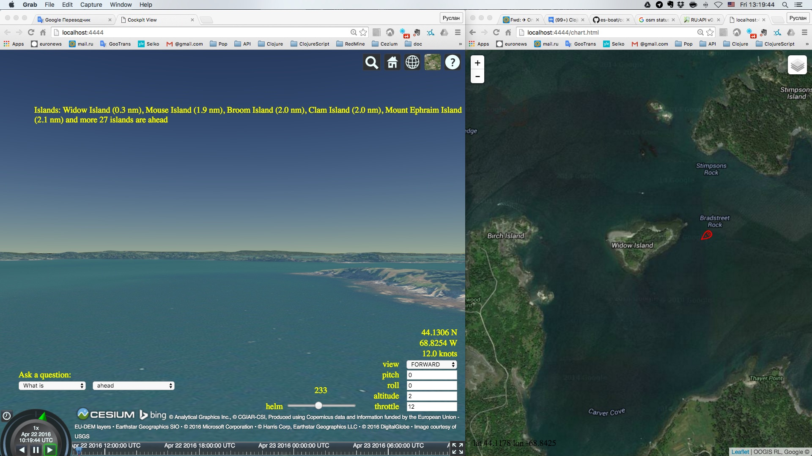

# es-boat

A prototype of an expert system for coastal navigation - the test example for the [rete4frames] (http://github.com/rururu/rete4frames) expert system shell.

It uses [Protege-3.5 ontology editor] (http://protege.stanford.edu/) as a knowledge representation system and GUI, [OpenStreetMap] (https://wiki.openstreetmap.org/wiki/API) API, [Leaflet] (http://leafletjs.com) JavaScript library and [Cesium] (https://cesiumjs.org/) WebGL virtual globe and map engine.



## Start

```
$ cd <..>/es-boat/pro-server
$ lein run
```
## Usage

In the Protege window, run the menu item: Edit -> ClojureWork.

This starts a script that loads needed programs, starts expert system and opens browser window with a HUD and the controls of a boat. Set a throttle to some reasonable boat speed value in nautical miles. Contol course of the boat with a helm. The helm has 5 positions, from left to right: "hard a port", "port", "midship", "starboard", "hard a starboard". Preferred browser is Google Chrome.

You can open a nautical chart in another browser window on the address http://localhost:4444/chart.html.

For now expert system answers questions about nearby islands and other geographical objects and shows them on the HUD. More features will come soon. Stay tuned.

Honestly, this is not only the boat, but also a vehicle that can go upon the ground along the roads and off roads. More then this, it is a flying apparatus that can fly above the ground and the sea. Just set the desired altitude and speed. Top secret! This is also a spacecraft, just set the altitude more then 120000. Happy flying!

Copyright and license
----

Copyright © 2016 Ruslan Sorokin.
Licensed under the EPL (see the file epl.html).
[License of Protege-3.5] (https://github.com/rururu/es-boat/blob/master/LICENSE)

